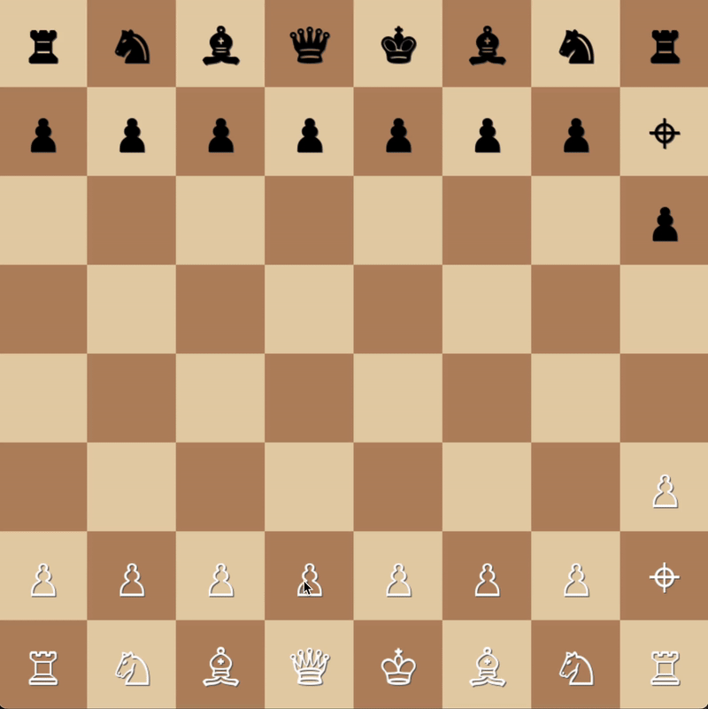

# Chess 2



Chess is awesome, but the last patch was over 100 years ago, so here are some much-needed improvements:

* Knights now jump in all directions, because real horses stopped using L-shaped movement centuries ago.
* Stalemate is no longer a draw. If you can't move, that's a you problem. Your opponent gets another turn.
* Bishops can no longer capture queens. Feels wrong.
* Added a new piece on h2/h7, the spy. Moves like a knight, but converts enemy pieces instead of capturing them. Can only convert once and dies in the process.
* *Ėń pãşšãñţ*  has been disabled, so nobody ever has to spell it again.
* Pawns can now move and capture both forwards and diagonally, like normal people. But they still can't move backwards. That would be ridiculous.
* Fixed a bug where computers were better at chess than humans.

## How to start

Install dependencies:

```sh
pip install -r requirements.lock
```

Start game:

```python
python src/play.py
```

You play against a randomizing AI. Press `Esc` to restart the game.

## Development

Install dev dependencies:

```sh
pip install -r requirements.lock -e ".[dev]"
```

Creating Mac/Windows executables into `/dist` for releases:
```sh
pyinstaller chess2.spec
```
