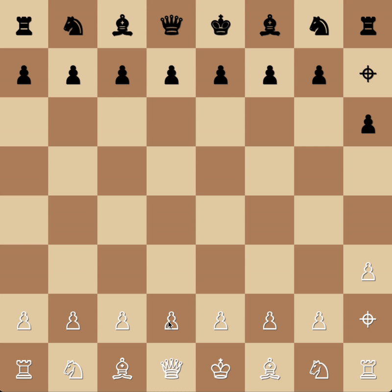

# Chess 2

<p align="center">
    
</p>

The last patch for chess was probably shipped over 100 years ago, so it's time for some improvements:

* Knights can now jump in all directions, because real horses stopped using L-shaped movement centuries ago.
* Stalemate is no longer a draw. If you can't move, that's a you problem and your opponent gets another turn.
* *Ėń pãşšãñţ*  has been disabled, so nobody ever has to spell it again.
* Added a new piece on h2/h7, the spy. Moves in sneaky L-shapes, but converts enemy pieces instead of capturing them. Can only convert once and dies in the process.
* Bishops can no longer capture queens. Just doesn't seem right.
* Fixed a bug where computers were better at chess than humans.
* Pawns can now move and capture both forwards and diagonally, like normal people. But they still can't move backwards. That would be ridiculous.


## Installation

### Option 1: Executables

Executables for mac os and windows can be found under [releases](https://github.com/amagrabi/chess2/releases).

### Option 2: Python

Create and activate a virtual environment, for example via [uv](https://docs.astral.sh/uv/getting-started/installation/):

```sh
uv venv
source .venv/bin/activate
```

Install dependencies in editable mode:
```sh
uv pip install -e .
```

Start game:
```sh
chess2
```

### Option 3: Docker

Requirements: Install [XQuartz](https://www.xquartz.org/) (Mac) or [Xming](https://sourceforge.net/projects/xming/) (Windows). 

Build and start the Docker container:
```sh
docker-compose build
docker-compose up
```

## Development

Install dev dependencies:
```sh
uv pip install -e ".[dev]"
```

Install pre-commit hooks for auto-formatting:
```sh
pre-commit install
```

Run tests:
```sh
pytest tests/
```

Creating Mac/Windows executables into `/dist` for releases:
```sh
pyinstaller chess2.spec
```
